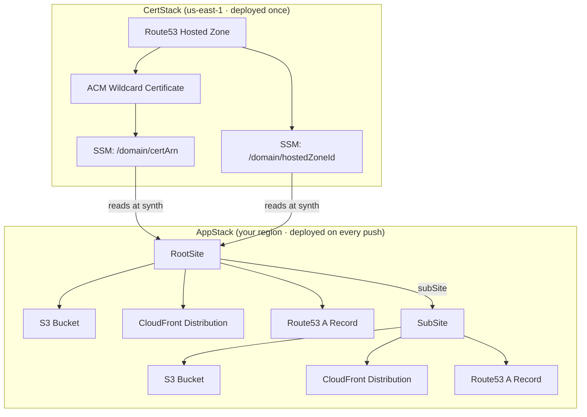

# genesis-cdk

AWS CDK constructs for deploying static websites — S3, CloudFront, Route53, ACM — with zero infrastructure knowledge required.

**genesis-cdk takes you from nothing → a deployed, HTTPS website on your own domain** using AWS best practices.

---

## Prerequisites

- An AWS account
- A registered domain (the domain itself, not hosted in Route53 yet — genesis-cdk creates the hosted zone)
- Node.js 18+
- AWS CLI configured (`aws configure`)
- AWS CDK CLI (`npm install -g aws-cdk`)

---

## How it works

genesis-cdk has two stacks that you deploy once each, in order:

1. **CertStack** — one-time setup. Creates the Route53 hosted zone and ACM wildcard TLS certificate for your domain. Stores the outputs in AWS SSM so your app stack can find them automatically. Must be deployed before the app stack.

2. **AppStack** — deployed on every commit in CI. Reads the cert and hosted zone from SSM, then creates S3 buckets, CloudFront distributions, and DNS records for your root site and any subdomains.

---

## Quickstart

### 1. Install

```bash
npm install genesis-cdk aws-cdk-lib constructs
```

### 2. Write your cert entrypoint

Create `cdk/cert.ts`:

```ts
#!/usr/bin/env node
import * as cdk from 'aws-cdk-lib';
import { CertStack } from 'genesis-cdk';

const app = new cdk.App();

new CertStack(app, 'CertStack', {
  domain: 'example.com',
  accountId: '123456789012',
  githubRepo: 'my-org/my-repo',  // scopes the CI role to this repo's main branch
});
```

### 3. Write your app entrypoint

Create `cdk/app.ts`:

```ts
#!/usr/bin/env node
import * as cdk from 'aws-cdk-lib';
import { RootSite } from 'genesis-cdk';

const app = new cdk.App();

const stack = new cdk.Stack(app, 'AppStack', {
  env: { account: '123456789012', region: 'eu-west-2' },
});

const root = new RootSite({
  scope: stack,
  domain: 'example.com',
  src: './dist',           // path to your built frontend
});

// Add subdomains (optional)
root.subSite({
  domain: 'app',           // deploys to app.example.com
  src: './packages/app/dist',
});
```

### 4. Add a cdk.json

Create `cdk.json` at your repo root:

```json
{
  "app": "npx ts-node --prefer-ts-exts cdk/app.ts"
}
```

### 5. Deploy the cert stack (one time only)

```bash
npx cdk --app "npx ts-node --prefer-ts-exts cdk/cert.ts" deploy CertStack
```

After this completes, **update your domain's nameservers** at your registrar to point to the Route53 hosted zone. You can find the nameservers in the AWS Console under Route53 → Hosted Zones → your domain.

Wait for DNS propagation (up to 48 hours, usually under an hour) before deploying the app stack — ACM needs to validate the certificate via DNS.

### 6. Deploy the app stack

```bash
npx cdk deploy AppStack
```

Your site is live.

---

## CI/CD with GitHub Actions

A typical setup has two workflows:

- **`deploy-cert.yml`** — triggered manually or on changes to `cdk/cert.ts`. Runs once when you set up a new domain.
- **`deploy.yml`** — triggered on every push to `main`. Builds your frontend and deploys the app stack.

### AWS credentials

genesis-cdk uses **GitHub Actions OIDC** — no long-lived credentials are stored anywhere. `CertStack` creates an IAM role that GitHub Actions can assume directly via a short-lived token exchange. There are no access keys to rotate or leak.

After deploying `CertStack`, retrieve the role ARN:

```bash
aws cloudformation describe-stacks \
  --stack-name CertStack \
  --query "Stacks[0].Outputs[?OutputKey=='CiRoleArn'].OutputValue" \
  --output text
```

Add it to your GitHub repo under **Settings → Secrets and variables → Actions**:

| Secret | Value |
|--------|-------|
| `AWS_ROLE_ARN` | The `CiRoleArn` output from above |

That's the only secret you need. The role is scoped to the `main` branch of the repo you passed as `githubRepo` — no other branch or repo can assume it.

### deploy-cert.yml

Run this once when setting up a new domain. Trigger it manually from the Actions tab. This step requires your personal AWS credentials since it creates the OIDC provider and role — after this, the role takes over for all future deploys.

```yaml
name: Deploy Cert Stack

on:
  workflow_dispatch:

jobs:
  deploy-cert:
    runs-on: ubuntu-latest
    steps:
      - uses: actions/checkout@v4

      - uses: actions/setup-node@v4
        with:
          node-version: '20'
          cache: 'npm'

      - run: npm ci

      - name: Configure AWS credentials
        uses: aws-actions/configure-aws-credentials@v4
        with:
          aws-access-key-id: ${{ secrets.AWS_ACCESS_KEY_ID }}
          aws-secret-access-key: ${{ secrets.AWS_SECRET_ACCESS_KEY }}
          aws-region: us-east-1

      - name: Bootstrap CDK (us-east-1)
        run: npx cdk bootstrap aws://YOUR_ACCOUNT_ID/us-east-1

      - name: Deploy CertStack
        run: npx cdk --app "npx ts-node --prefer-ts-exts cdk/cert.ts" deploy CertStack --require-approval never
```

### deploy.yml

Runs on every push to `main`. No AWS secrets needed — the workflow assumes the OIDC role directly.

```yaml
name: Deploy

on:
  push:
    branches: [main]

permissions:
  id-token: write   # required for OIDC token request
  contents: read

jobs:
  deploy:
    runs-on: ubuntu-latest
    steps:
      - uses: actions/checkout@v4

      - uses: actions/setup-node@v4
        with:
          node-version: '20'
          cache: 'npm'

      - run: npm ci

      - name: Build frontend
        run: npm run build        # adjust to your build command

      - name: Configure AWS credentials
        uses: aws-actions/configure-aws-credentials@v4
        with:
          role-to-assume: ${{ secrets.AWS_ROLE_ARN }}
          aws-region: eu-west-2   # your app region

      - name: Bootstrap CDK
        run: npx cdk bootstrap aws://YOUR_ACCOUNT_ID/eu-west-2

      - name: Deploy AppStack
        run: npx cdk deploy AppStack --require-approval never
```

> **Note:** `cdk bootstrap` is idempotent — safe to run on every deploy. You can move it to a one-time step once the environment is stable.

---

## Subdomains

Call `subSite()` on your `RootSite` for each subdomain:

```ts
const root = new RootSite({ scope: stack, domain: 'example.com', src: './dist' });

root.subSite({ domain: 'blog',  src: './blog/dist' });   // blog.example.com
root.subSite({ domain: 'docs',  src: './docs/dist' });   // docs.example.com
```

Each subdomain gets its own S3 bucket and CloudFront distribution, sharing the parent's hosted zone and wildcard certificate.

---

## Adding an API

Use the `Backend` construct to add an API Gateway behind CloudFront on `/api/*`:

```ts
import { RootSite, Backend } from 'genesis-cdk';

const root = new RootSite({ scope: stack, domain: 'example.com', src: './dist' });

const backend = new Backend({
  scope: stack,
  id: 'my_backend',
  domain: 'example.com',
  cloudfront: root.cloudfrontDist,
  hostedZone: root.hostedZone,    
  certArn: '...',
});

// Add Lambda integrations to backend.api
```

---

## Architecture


