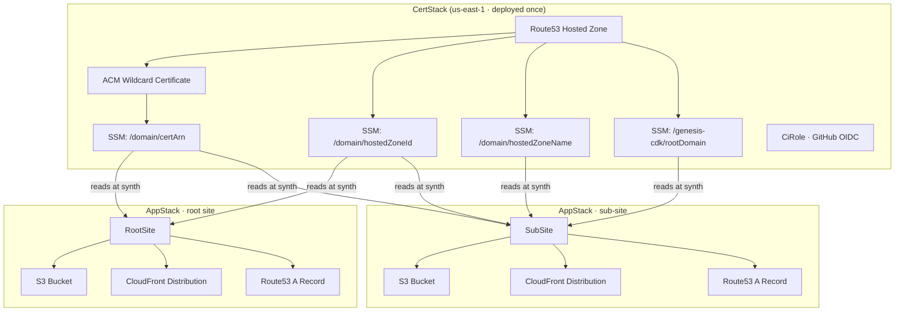

# genesis-cdk

CDK constructs for deploying static websites on AWS — S3, CloudFront, Route53, ACM.

---

## Install

```bash
npm install github:sc/genesis-cdk
```

---

## Root site setup

Do this once per domain. It creates the hosted zone, wildcard certificate, and a GitHub Actions OIDC role.

**1. Create `bin/cert.ts`**

```ts
#!/usr/bin/env node
import * as cdk from 'aws-cdk-lib';
import { CertStack, CiRole } from 'genesis-cdk';

const app = new cdk.App();

const certStack = new CertStack(app, 'CertStack', {
  domain: 'example.com',
  accountId: process.env.CDK_DEFAULT_ACCOUNT!,
});

new CiRole(certStack, 'CiRole', {
  domain: 'example.com',
  accountId: process.env.CDK_DEFAULT_ACCOUNT!,
  githubRepos: ['my-org/my-repo'],
});
```

**2. Create `bin/app.ts`**

```ts
#!/usr/bin/env node
import * as cdk from 'aws-cdk-lib';
import { RootSite } from 'genesis-cdk';

const app = new cdk.App();

const stack = new cdk.Stack(app, 'AppStack', {
  env: {
    account: process.env.CDK_DEFAULT_ACCOUNT,
    region: 'eu-west-2',
  },
});

new RootSite({
  scope: stack,
  domain: 'example.com',
  src: './dist',
});
```

**3. Add `cdk.json`**

```json
{
  "app": "npx ts-node --esm bin/app.ts"
}
```

**4. Bootstrap and deploy the cert stack (once)**

```bash
export CDK_DEFAULT_ACCOUNT=123456789012

npx cdk bootstrap aws://$CDK_DEFAULT_ACCOUNT/us-east-1
npx cdk deploy --all --app "npx ts-node --esm bin/cert.ts"
```

**5. Point your domain's nameservers at Route53**

Find the NS records in the AWS console under Route53 → Hosted Zones → example.com, then update them at your domain registrar. Wait for DNS to propagate before the next step.

**6. Get the CI role ARN and save it as a GitHub secret**

```bash
aws cloudformation describe-stacks \
  --stack-name CertStack \
  --query "Stacks[0].Outputs[?OutputKey=='CiRoleArn'].OutputValue" \
  --output text
```

Add the output as `AWS_ROLE_ARN` in GitHub → Settings → Secrets.

**7. Deploy the app stack**

```bash
npx cdk deploy AppStack
```

---

## Sub-site setup

Use this in any repo that deploys a subdomain. The root domain, certificate, and hosted zone are all read from SSM automatically — no config needed beyond the subdomain label and source path.

**Prerequisite:** the root site's `CertStack` must already be deployed.

**1. Create `bin/app.ts`**

```ts
#!/usr/bin/env node
import * as cdk from 'aws-cdk-lib';
import { SubSite } from 'genesis-cdk';

const app = new cdk.App();

const stack = new cdk.Stack(app, 'AppStack', {
  env: {
    account: process.env.CDK_DEFAULT_ACCOUNT,
    region: 'eu-west-2',
  },
});

new SubSite({
  scope: stack,
  domain: 'blog',   // deploys to blog.example.com
  src: './dist',
});
```

**2. Add `cdk.json`**

```json
{
  "app": "npx ts-node --esm bin/app.ts"
}
```

**3. Deploy**

```bash
npx cdk deploy AppStack
```

---

## CI/CD

Both workflows are reusable — call them from any repo.

### deploy-cert.yml (once per domain)

```yaml
on:
  workflow_dispatch:

jobs:
  cert:
    uses: sc/genesis-cdk/.github/workflows/deploy-cert.yml@main
    with:
      domain: example.com
      github-repo: my-org/my-repo
    secrets:
      aws-access-key-id: ${{ secrets.AWS_ACCESS_KEY_ID }}
      aws-secret-access-key: ${{ secrets.AWS_SECRET_ACCESS_KEY }}
```

### deploy.yml (every push to main)

```yaml
on:
  push:
    branches: [main]

permissions:
  id-token: write
  contents: read

jobs:
  deploy:
    uses: sc/genesis-cdk/.github/workflows/deploy-app.yml@main
    with:
      domain: example.com
      aws-region: eu-west-2
      role-arn: ${{ secrets.AWS_ROLE_ARN }}
      build-command: npm run build
```

---

## Architecture


