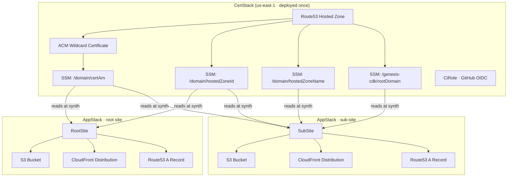

# genesis-cdk

CDK constructs for deploying static websites on AWS — S3, CloudFront, Route53, ACM.

---

## Prerequisites

- AWS CLI configured with credentials
- Node.js 18+
- AWS CDK bootstrapped in your account (`npx cdk bootstrap`)

---

## Setup

### 1. Clone this repo into your project

```bash
git clone https://github.com/sc/genesis-cdk.git
```

### 2. Run the setup script

**Root site** — do this once per domain. Sets up the hosted zone, wildcard certificate, and GitHub Actions OIDC role.

```bash
node genesis-cdk/setup.js --root --domain=example.com
```

**Sub-site** — use this in any repo that deploys a subdomain. Requires the root site's cert stack to already be deployed.

```bash
node genesis-cdk/setup.js --site --domain=example.com --subdomain=blog
```

Optional flag: `--src=./dist` to set the path to your build output (defaults to `./dist`).

The script scaffolds `bin/app.ts`, `cdk.json`, and `tsconfig.json` into your project root and installs CDK dependencies.

### 3. Update the configuration

Open `bin/app.ts` and verify:

- **`domain`** — your root domain (e.g. `example.com`) or full subdomain (e.g. `blog.example.com`)
- **`src`** — path to your built site output (e.g. `./dist`)

For root sites, also open `bin/cert.ts` and set:

- **`githubRepos`** — the GitHub repos that should have deploy access (e.g. `['my-org/my-repo']`)

---

## Deploying

### Root site (first time)

**1. Bootstrap CDK in us-east-1** (the certificate must live there for CloudFront)

```bash
export CDK_DEFAULT_ACCOUNT=123456789012
npx cdk bootstrap aws://$CDK_DEFAULT_ACCOUNT/us-east-1
```

**2. Deploy the cert stack**

```bash
npx cdk deploy --all --app "npx ts-node --esm bin/cert.ts"
```

**3. Point your domain's nameservers at Route53**

Find the NS records in the AWS console under Route53 → Hosted Zones → example.com, then update them at your domain registrar. Wait for DNS to propagate before the next step.

**4. Save the CI role ARN as a GitHub secret**

```bash
aws cloudformation describe-stacks \
  --stack-name example-com-cert \
  --query "Stacks[0].Outputs[?OutputKey=='CiRoleArn'].OutputValue" \
  --output text
```

Add the output as `AWS_ROLE_ARN` in GitHub → Settings → Secrets.

**5. Deploy the site**

```bash
npx cdk deploy example-com
```

### Sub-site

```bash
npx cdk deploy blog-example-com
```

---

## CI/CD

### deploy.yml (every push to main)

```yaml
on:
  push:
    branches: [main]

permissions:
  id-token: write
  contents: read

jobs:
  deploy:
    uses: sc/genesis-cdk/.github/workflows/deploy-app.yml@main
    with:
      domain: example.com
      aws-region: eu-west-2
      role-arn: ${{ secrets.AWS_ROLE_ARN }}
      build-command: npm run build
```

---

## Architecture


