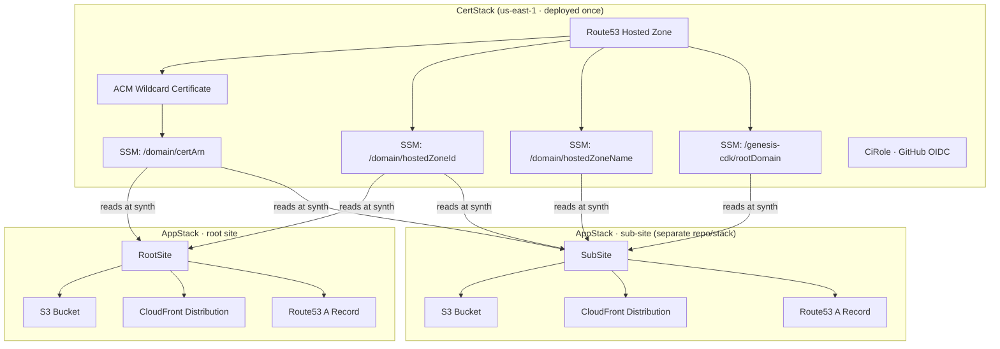

# genesis-cdk

AWS CDK constructs for deploying static websites — S3, CloudFront, Route53, ACM — with zero infrastructure knowledge required.

**genesis-cdk takes you from nothing → a deployed, HTTPS website on your own domain** using AWS best practices.

---

## Prerequisites

- An AWS account
- A registered domain (the domain itself, not hosted in Route53 yet — genesis-cdk creates the hosted zone)
- Node.js 18+
- AWS CLI configured (`aws configure`)
- AWS CDK CLI (`npm install -g aws-cdk`)

---

## Quickstart

### Option 1: Full setup — root site + certificate

Use this when setting up a new domain from scratch.

```bash
npx genesis-cdk init --core
```

This installs all dependencies and scaffolds:

- `bin/cert.ts` — deploys `CertStack` (hosted zone + ACM certificate) and `CiRole` (GitHub Actions OIDC role), outputs stored in SSM for other stacks to consume
- `bin/app.ts` — deploys `AppStack` with a `RootSite` that reads cert and zone from SSM

**Deploy order:**

```bash
export DOMAIN=example.com
export GITHUB_REPOSITORY=my-org/my-repo
export CDK_DEFAULT_ACCOUNT=123456789012

# 1. Deploy once — creates the hosted zone, certificate, and CI role
cdk deploy CertStack --app "npx ts-node --esm bin/cert.ts"

# 2. Update your domain's nameservers at your registrar to point to Route53
#    (find them in the AWS Console → Route53 → Hosted Zones → your domain)
#    Wait for DNS propagation before continuing.

# 3. Deploy on every commit
cdk deploy AppStack
```

---

### Option 2: Sub-site only

Use this when the root domain is already set up (CertStack already deployed) and you want to deploy a subdomain from a separate repo or stack.

```bash
npx genesis-cdk init --site
```

This installs all dependencies and scaffolds:

- `bin/app.ts` — deploys `AppStack` with a `SubSite` that reads the root domain, certificate, and hosted zone from SSM automatically

```bash
# 1. Edit bin/app.ts — set the subdomain label and src path
# 2. Deploy
cdk deploy AppStack
```

No `DOMAIN` variable needed — the root domain is looked up from the SSM parameter `/genesis-cdk/rootDomain` written by `CertStack`.

---

## Constructs

### `CertStack`

One-time per domain. Always deploys to `us-east-1` (required by ACM for CloudFront).

Creates a Route53 hosted zone, ACM wildcard certificate, and writes everything to SSM:

| SSM Parameter | Value |
|---|---|
| `/<domain>/certArn` | ACM certificate ARN |
| `/<domain>/hostedZoneId` | Route53 hosted zone ID |
| `/<domain>/hostedZoneName` | Root domain name |
| `/genesis-cdk/rootDomain` | Root domain name (read by `SubSite`) |

```ts
import { CertStack } from 'genesis-cdk';

new CertStack(app, 'CertStack', {
  domain: 'example.com',
  accountId: '123456789012',
});
```

### `CiRole`

Creates a GitHub Actions OIDC role scoped to a specific repo and branch. No long-lived credentials needed — GitHub Actions assumes the role via a short-lived token exchange.

Deploy alongside `CertStack` as part of your one-time setup:

```ts
import { CertStack, CiRole } from 'genesis-cdk';

const certStack = new CertStack(app, 'CertStack', {
  domain: 'example.com',
  accountId: '123456789012',
});

new CiRole(certStack, 'CiRole', {
  domain: 'example.com',
  accountId: '123456789012',
  githubRepo: 'my-org/my-repo',  // scoped to main branch only
});
```

After deploying, retrieve the role ARN and add it to GitHub → Settings → Secrets as `AWS_ROLE_ARN`:

```bash
aws cloudformation describe-stacks \
  --stack-name CertStack \
  --query "Stacks[0].Outputs[?OutputKey=='CiRoleArn'].OutputValue" \
  --output text
```

### `RootSite`

Deploys the root domain (`example.com`). Reads `certArn` and `hostedZoneId` from SSM at synth time.

```ts
import { RootSite } from 'genesis-cdk';

const root = new RootSite({
  scope: stack,
  domain: 'example.com',
  src: './dist',
});
```

### `SubSite`

Deploys a subdomain as a fully independent stack. Reads the root domain, certificate, and hosted zone entirely from SSM — no manual configuration needed beyond the subdomain label and source path.

```ts
import { SubSite } from 'genesis-cdk';

new SubSite({
  scope: stack,
  domain: 'blog',   // deploys to blog.example.com
  src: './dist',
});
```

The root domain is resolved from `/genesis-cdk/rootDomain` written by `CertStack`.

### `Backend` (optional)

Adds an API Gateway behind CloudFront on `/api/*`:

```ts
import { RootSite, Backend } from 'genesis-cdk';

const root = new RootSite({ scope: stack, domain: 'example.com', src: './dist' });

new Backend({
  scope: stack,
  id: 'my_backend',
  domain: 'example.com',
  cloudfront: root.cloudfrontDist,
});
```

---

## Subdomains in the same stack

Call `subSite()` on a `RootSite` to add subdomains to the same stack:

```ts
const root = new RootSite({ scope: stack, domain: 'example.com', src: './dist' });

root.subSite({ domain: 'blog', src: './blog/dist' });  // blog.example.com
root.subSite({ domain: 'docs', src: './docs/dist' });  // docs.example.com
```

For subdomains in a separate stack or repo, use `SubSite` instead.

---

## CI/CD with GitHub Actions

### deploy-cert.yml

Run once when setting up a new domain. Uses personal AWS credentials to bootstrap the OIDC provider — after this the CI role takes over for all future deploys.

```yaml
name: Deploy Cert Stack

on:
  workflow_dispatch:

jobs:
  deploy-cert:
    runs-on: ubuntu-latest
    steps:
      - uses: actions/checkout@v4
      - uses: actions/setup-node@v4
        with:
          node-version: '20'
          cache: 'npm'
      - run: npm ci
      - name: Configure AWS credentials
        uses: aws-actions/configure-aws-credentials@v4
        with:
          aws-access-key-id: ${{ secrets.AWS_ACCESS_KEY_ID }}
          aws-secret-access-key: ${{ secrets.AWS_SECRET_ACCESS_KEY }}
          aws-region: us-east-1
      - run: npx cdk bootstrap aws://${{ secrets.AWS_ACCOUNT_ID }}/us-east-1
      - run: npx cdk deploy CertStack --app "npx ts-node --esm bin/cert.ts" --require-approval never
        env:
          DOMAIN: example.com
          GITHUB_REPOSITORY: my-org/my-repo
          CDK_DEFAULT_ACCOUNT: ${{ secrets.AWS_ACCOUNT_ID }}
```

### deploy.yml

Runs on every push to `main`. No AWS secrets needed — assumes the OIDC role created by `CiRole`.

```yaml
name: Deploy

on:
  push:
    branches: [main]

permissions:
  id-token: write
  contents: read

jobs:
  deploy:
    runs-on: ubuntu-latest
    steps:
      - uses: actions/checkout@v4
      - uses: actions/setup-node@v4
        with:
          node-version: '20'
          cache: 'npm'
      - run: npm ci
      - run: npm run build
      - name: Configure AWS credentials
        uses: aws-actions/configure-aws-credentials@v4
        with:
          role-to-assume: ${{ secrets.AWS_ROLE_ARN }}
          aws-region: eu-west-2
      - run: npx cdk deploy AppStack --require-approval never
```

---

## Architecture


